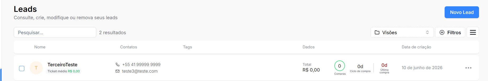
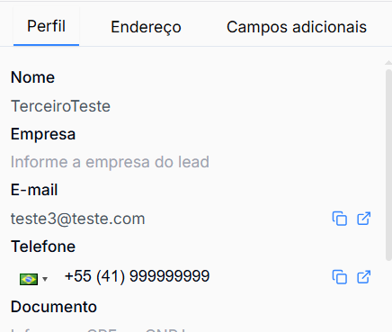
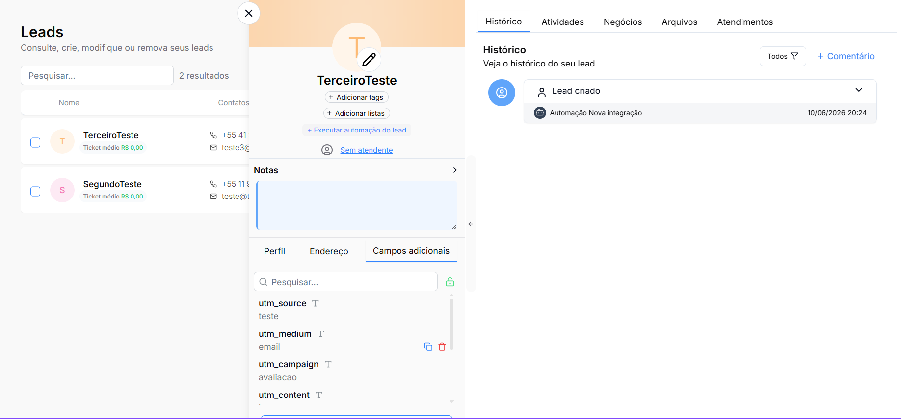
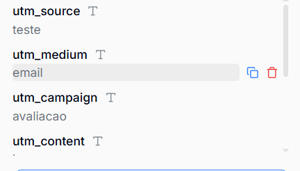
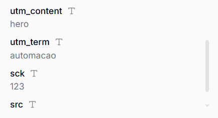
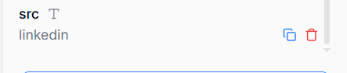

# Outlier Experience 2025 — Landing Page

Teste técnico para a vaga de Gerente de Automações da [Ticto](https://ticto.com.br).

Landing page de captura do evento **Outlier Experience 2025**, com formulário YayForms embeddado, integração com o CRM Datacrazy e rastreamento completo de parâmetros UTM, SCK e SRC.

**Deploy:** https://teste-ticto.vercel.app
**URL de teste com parâmetros:** https://teste-ticto.vercel.app?utm_source=teste&utm_medium=email&utm_campaign=avaliacao&utm_content=hero&utm_term=automacao&sck=123&src=linkedin

---

## Como rodar o projeto localmente

**Pré-requisitos:** Node.js 18+ e npm.

```bash
# 1. Clone o repositório
git clone https://github.com/Caetanogp/Teste_Ticto.git
cd Teste_Ticto

# 2. Instale as dependências
npm install

# 3. Crie o arquivo de variáveis de ambiente
cp .env.example .env.local
# Edite .env.local com os valores reais (veja a seção abaixo)

# 4. Inicie o servidor de desenvolvimento
npm run dev
```

Acesse [http://localhost:3000](http://localhost:3000).

### Variáveis de ambiente

| Variável | Descrição |
|---|---|
| `NEXT_PUBLIC_YAYFORMS_EMBED_URL` | URL direta do formulário YayForms |
| `NEXT_PUBLIC_YAYFORMS_EMBED_ID` | ID do formulário YayForms |
| `NEXT_PUBLIC_SITE_URL` | URL de produção do projeto |

---

## Decisões técnicas

### Stack

- **Next.js 16 (App Router) + React 19 + TypeScript** — obrigatório pelo enunciado; App Router escolhido por ser a abordagem moderna e recomendada pelo Next.js.
- **Tailwind CSS v4** — produtividade na estilização com tokens de design centralizados, sem CSS customizado desnecessário.
- **Inter (Google Fonts via `next/font`)** — tipografia fiel ao layout de referência, com carregamento otimizado.

### Embed do formulário: iframe direto

O YayForms oferece dois métodos de embed: script (`<div data-yf-widget>`) e iframe direto. Optei pelo **iframe direto** após verificar que o método de script não encaminhava os parâmetros UTM corretamente para o webhook do Datacrazy.

Com o iframe, os parâmetros de rastreamento são anexados diretamente à URL do formulário:

```
https://caetano3.yayforms.link/lydOo2b?utm_source=teste&utm_medium=email&...
```

O YayForms captura esses parâmetros nativamente (toggle "Rastreamento UTM" ativado na aba Compartilhar) e os inclui no payload enviado ao webhook do Datacrazy no objeto `response.tracking`.

### Encaminhamento de parâmetros de rastreamento

O componente `YayFormsEmbed` usa `useSearchParams` (hook do Next.js) para ler os 7 parâmetros da URL da landing page em tempo real e repassá-los ao iframe. Como `useSearchParams` requer hidratação no cliente, o componente é envolvido em um `<Suspense>` boundary, conforme exigido pelo App Router.

Os parâmetros rastreados são:

| Parâmetro | Origem no Datacrazy |
|---|---|
| `utm_source` | `response.tracking.utm_source` |
| `utm_medium` | `response.tracking.utm_medium` |
| `utm_campaign` | `response.tracking.utm_campaign` |
| `utm_content` | `response.tracking.utm_content` |
| `utm_term` | `response.tracking.utm_term` |
| `sck` | `response.hiddenFields` (campo oculto YayForms) |
| `src` | `response.hiddenFields` (campo oculto YayForms) |

### Integração Datacrazy

A integração foi feita via **webhook nativo do YayForms** apontando para o endpoint do Datacrazy. Os campos do lead (nome, e-mail, telefone) foram mapeados com os caminhos JSON do payload do YayForms. Os parâmetros UTM foram mapeados nos "Campos adicionais" do Datacrazy usando os caminhos `response.tracking.*`.

---

## Dificuldades encontradas

### 1. Figma inacessível

O arquivo do Figma fornecido no enunciado pertence à organização da Ticto. Meu token pessoal retornou 404 na API. Como não era possível solicitar acesso à empresa durante o teste, utilizei o site de referência [lp3.outlierxp.com.br](https://lp3.outlierxp.com.br) para extrair os textos, estrutura de seções e identidade visual do evento.

### 2. Método de embed do YayForms e passagem de UTMs

A abordagem inicial com o atributo `data-yf-transitive-search-params` no script embed não resultou nos parâmetros chegando ao Datacrazy. Após análise do payload real recebido no webhook, identifiquei que o YayForms captura UTMs nativamente via URL quando o toggle de rastreamento está ativo. A solução foi migrar para iframe com os parâmetros anexados diretamente à URL do `src`.

### 3. Campos ocultos `utm_*` reservados no YayForms

Ao tentar criar campos ocultos para `utm_source`, `utm_medium` etc., o YayForms retornou erro informando que esses nomes já estão em uso — eles são reservados pelo sistema de rastreamento nativo. Os parâmetros UTM chegam ao Datacrazy via `response.tracking`, não via `hiddenFields`. Apenas `sck` e `src` foram adicionados como campos ocultos.

### 4. `useSearchParams` exige `<Suspense>` no App Router

O hook `useSearchParams` do Next.js lança um erro de build quando usado fora de um `Suspense` boundary no App Router. O componente `YayFormsEmbed` foi isolado com `<Suspense>` na `FormSection` para resolver o problema.

---

## Evidências

Lead criado no Datacrazy após submissão do formulário em produção, com os 7 parâmetros de rastreamento chegando junto com os dados do lead.

**Lead na lista do Datacrazy:**



**Dados do lead (nome, e-mail, telefone):**



**Lead aberto com a aba "Campos adicionais":**



**Parâmetros de rastreamento recebidos** (`utm_source`, `utm_medium`, `utm_campaign`, `utm_content`, `utm_term`, `sck`, `src`):





> Submissão feita via URL de teste com a query string completa de UTM/SCK/SRC. Os parâmetros `utm_*` chegam ao Datacrazy via objeto `response.tracking` do YayForms; `sck` e `src` chegam via `response.hiddenFields`.
